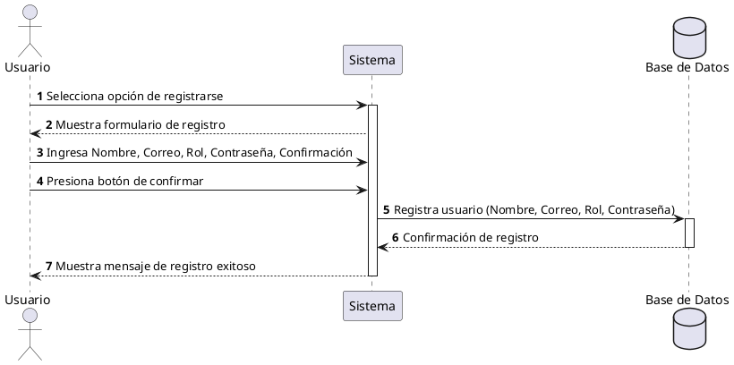

**Nombre:** Registro de Usuarios  
**ID:** CU-001  
**Descripción:** Permite al usuario crear una cuenta en el sistema utilizando su correo electrónico.  
**Actor:** Usuario  

**Precondiciones:**

- El usuario no debe estar registrado en el sistema.
- El usuario debe contar con un correo electrónico válido.

**Flujo principal:**

1. El usuario selecciona la opción de registrarse.
2. El sistema muestra el formulario de registro.
3. El usuario ingresa:
    - Nombre
    - Correo electrónico
    - Rol (Cliente/Vendedor)
    - Contraseña
    - Confirmación de contraseña
4. El usuario presiona el botón de confirmar.
5. El sistema registra al usuario en la base de datos.
6. El sistema muestra un mensaje de registro exitoso.

**Postcondiciones:**

- El usuario queda registrado en la base de datos del sistema.
- Se crea un perfil de usuario activo.

**Excepciones:**

- Credenciales inválidas.
- Correo ya registrado.
- Cancelación del proceso.

