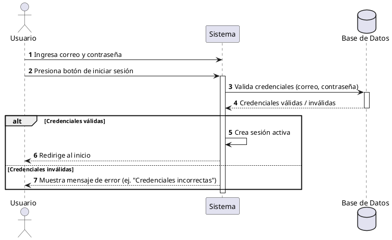

**Nombre:** Inicio de Sesión  
**ID:** CU-002  
**Descripción:** Permite al usuario acceder al sistema mediante sus credenciales.  
**Actor:** Usuario  

**Precondiciones:**

- El usuario debe estar registrado.

**Flujo principal:**

1. El usuario ingresa su correo y contraseña.
2. El usuario presiona el botón de iniciar sesión.
3. El sistema valida las credenciales.
4. El sistema crea una sesión activa.
5. El usuario es redirigido al inicio.

**Postcondiciones:**

- Se crea una sesión activa para el usuario.

**Excepciones:**

- Credenciales incorrectas.
- Usuario no registrado.

