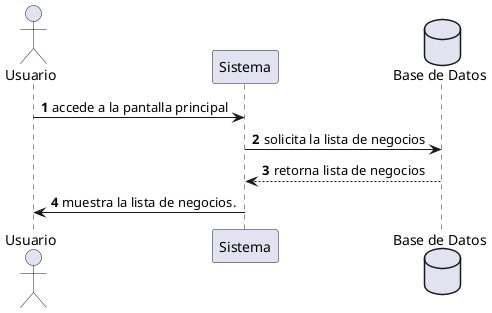

**Nombre:** Ver Negocios  
**ID:** CU-003  
**Descripción:** Permite al usuario visualizar la lista de negocios disponibles.  
**Actor:** Usuario  

**Precondiciones:**

- El usuario ha iniciado sesión.

**Flujo principal:**

1. El usuario accede a la pantalla principal.
2. El sistema muestra la lista de negocios.
3. El usuario puede desplazarse y explorar los negocios.

**Postcondiciones:**

- El usuario visualiza los negocios disponibles.

**Excepciones:**

- No hay negocios disponibles.

