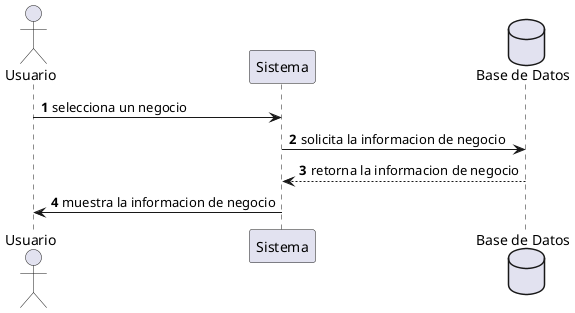

**Nombre:** Ver Detalles de Negocio  
**ID:** CU-004  
**Descripción:** Permite al usuario visualizar la información detallada de un negocio.  
**Actor:** Usuario  

**Precondiciones:**

- El usuario ha iniciado sesión.

**Flujo principal:**

1. El usuario selecciona un negocio.
2. El sistema muestra:
    - Información del negocio
    - Reseñas
    - Botón de ubicación
3. El usuario puede navegar por la información.

**Postcondiciones:**

- El usuario visualiza los detalles del negocio.

**Excepciones:**

- Negocio no disponible.

