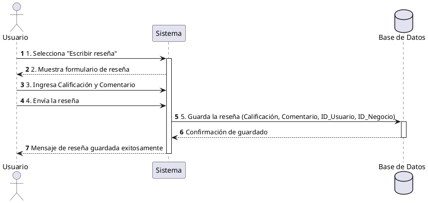

**Nombre:** Escribir Reseña  
**ID:** CU-005  
**Descripción:** Permite al usuario crear una reseña para un negocio.  
**Actor:** Usuario  

**Precondiciones:**

- El usuario ha iniciado sesión.
- El usuario se encuentra en un negocio.

**Flujo principal:**

1. El usuario selecciona “Escribir reseña”.
2. El sistema muestra el formulario.
3. El usuario ingresa:
    - Calificación
    - Comentario
4. El usuario envía la reseña.
5. El sistema guarda la reseña.

**Postcondiciones:**

- La reseña queda registrada.

**Excepciones:**

- N/A.

