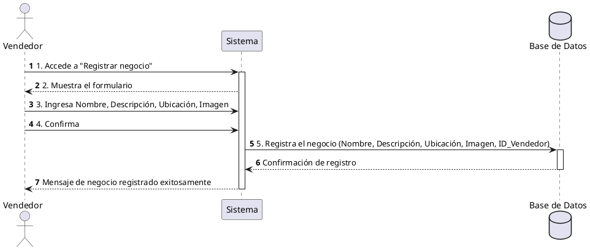

**Nombre:** Registrar Negocio  
**ID:** CU-006  
**Descripción:** Permite al vendedor registrar un nuevo negocio en el sistema.  
**Actor:** Vendedor  

**Precondiciones:**

- El usuario debe tener rol de vendedor.

**Flujo principal:**

1. El vendedor accede a “Registrar negocio”.
2. El sistema muestra el formulario.
3. El vendedor ingresa:
    - Nombre
    - Descripción
    - Ubicación
    - Imagen
4. El vendedor confirma.
5. El sistema registra el negocio.

**Postcondiciones:**

- El negocio queda registrado y asociado al vendedor.

**Excepciones:**

- Datos incompletos.

