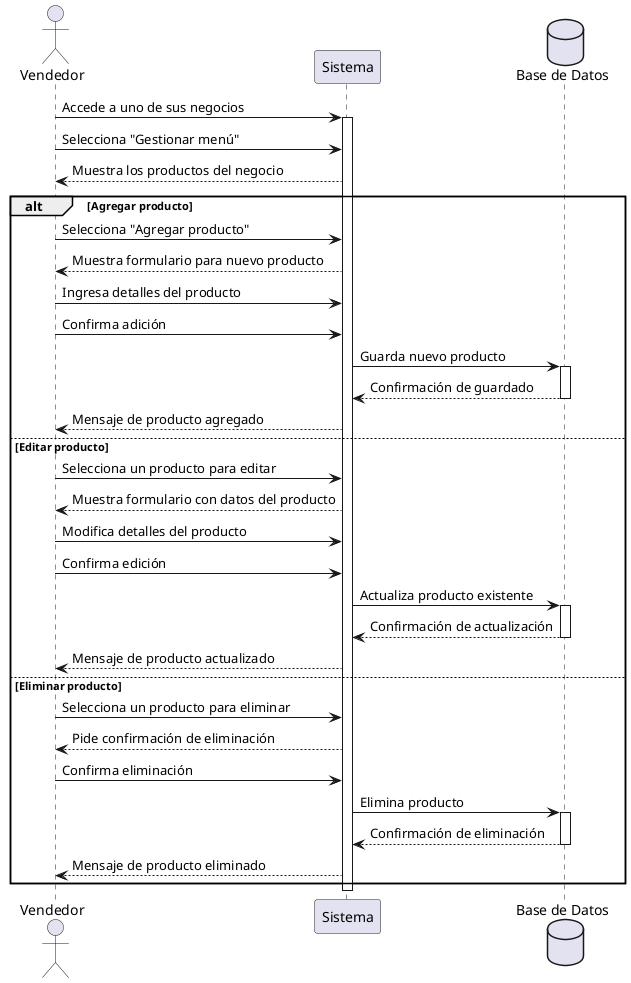

**Nombre:** Gestionar Menú  
**ID:** CU-007  
**Descripción:** Permite al vendedor administrar los productos de su negocio.  
**Actor:** Vendedor  

**Precondiciones:**

- El vendedor posee al menos un negocio.

**Flujo principal:**

1. El vendedor accede a uno de sus negocios.
2. Selecciona “Gestionar menú”.
3. El sistema muestra los productos.
4. El vendedor puede:
    - Agregar producto
    - Editar producto
    - Eliminar producto

**Postcondiciones:**

- El menú queda actualizado.

**Excepciones:**

- N/A.

