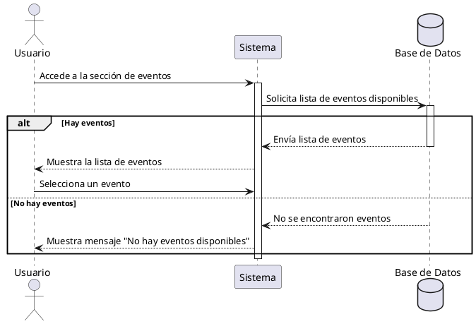

**Nombre:** Ver Eventos  
**ID:** CU-008  
**Descripción:** Permite al usuario visualizar eventos disponibles.  
**Actor:** Usuario  
**Relación:** N/A

**Precondiciones:**

- Usuario autenticado.

**Flujo principal:**

1. El usuario accede a la sección de eventos.
2. El sistema muestra la lista de eventos.
3. El usuario selecciona un evento.

**Postcondiciones:**

- El usuario visualiza eventos disponibles.

**Excepciones:**

- No hay eventos.

