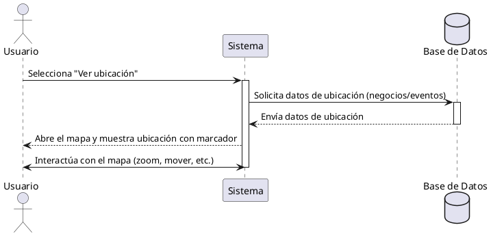

**Nombre:** Ver Mapa  
**ID:** CU-009  
**Descripción:** Permite al usuario visualizar la ubicación de negocios o eventos en un mapa.  
**Actor:** Usuario  

**Precondiciones:**

- Usuario autenticado.

**Flujo principal:**

1. El usuario selecciona “Ver ubicación”.
2. El sistema abre el mapa.
3. El sistema muestra la ubicación con un marcador.
4. El usuario puede interactuar con el mapa.

**Postcondiciones:**

- Ubicación visualizada.

**Excepciones:**

- N/A.

