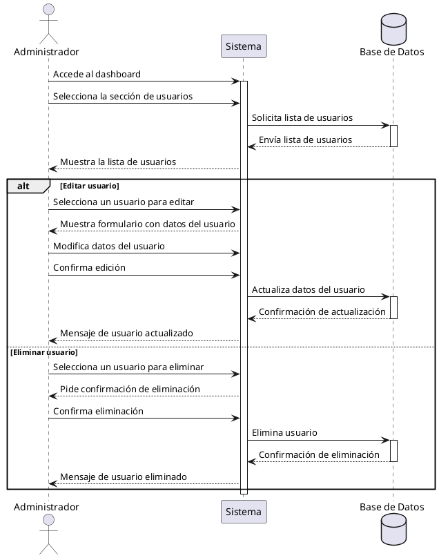

**Nombre:** Administrar Usuarios  
**ID:** CU-010  
**Descripción:** Permite al administrador gestionar usuarios del sistema.  
**Actor:** Administrador  

**Precondiciones:**

- Usuario con rol administrador.

**Flujo principal:**

1. El administrador accede al dashboard.
2. Selecciona la sección de usuarios.
3. El sistema muestra la lista.
4. El administrador puede editar o eliminar usuarios.

**Postcondiciones:**

- Cambios aplicados en usuarios.

**Excepciones:**

- Error al actualizar datos.

