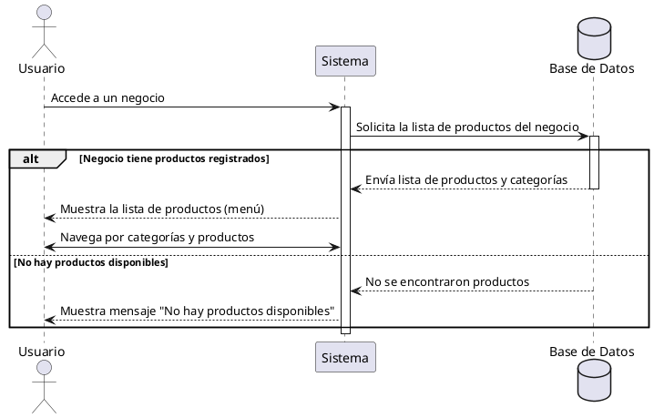

**Nombre:** Ver Menú  
**ID:** CU-011  
**Descripción:** Permite al usuario visualizar el menú de un negocio.  
**Actor:** Usuario  

**Precondiciones:**

- El usuario ha iniciado sesión.
- El negocio tiene productos registrados.

**Flujo principal:**

1. El usuario accede a un negocio.
2. El sistema muestra la lista de productos.
3. El usuario navega por las categorías y productos.

**Postcondiciones:**

- El usuario visualiza el menú del negocio.

**Excepciones:**

- No hay productos disponibles.

