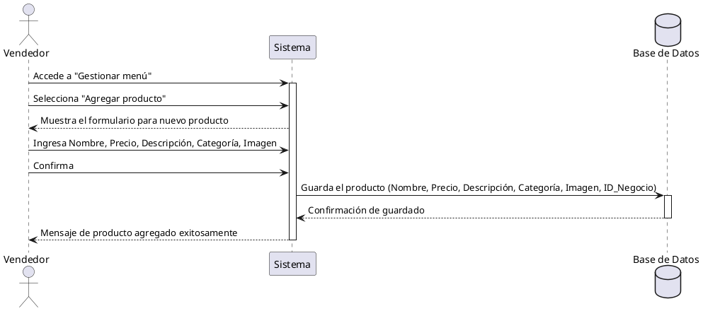

**Nombre:** Agregar Producto  
**ID:** CU-012  
**Descripción:** Permite al vendedor agregar un nuevo producto al menú de su negocio.  
**Actor:** Vendedor  

**Precondiciones:**

- El vendedor tiene un negocio registrado.

**Flujo principal:**

1. El vendedor accede a “Gestionar menú”.
2. Selecciona “Agregar producto”.
3. El sistema muestra el formulario.
4. El vendedor ingresa:
    - Nombre
    - Precio
    - Descripción
    - Categoría
    - Imagen
5. El vendedor confirma.
6. El sistema guarda el producto.

**Postcondiciones:**

- El producto queda registrado en el menú.

**Excepciones:**

- N/A.
