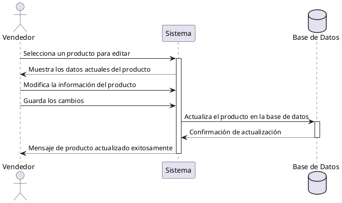

**Nombre:** Editar Producto  
**ID:** CU-013  
**Descripción:** Permite al vendedor modificar un producto existente.  
**Actor:** Vendedor  

**Precondiciones:**

- El producto existe.

**Flujo principal:**

1. El vendedor selecciona un producto.
2. El sistema muestra los datos actuales.
3. El vendedor modifica la información.
4. Guarda los cambios.
5. El sistema actualiza el producto.

**Postcondiciones:**

- Producto actualizado.

**Excepciones:**

- N/A.

