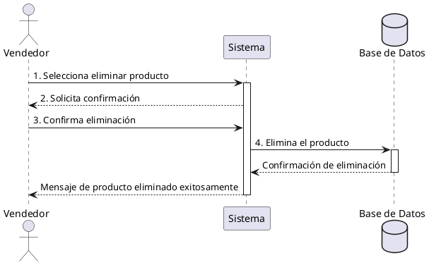

**Nombre:** Eliminar Producto  
**ID:** CU-014  
**Descripción:** Permite al vendedor eliminar un producto del menú.  
**Actor:** Vendedor  

**Precondiciones:**

- El producto existe.

**Flujo principal:**

1. El vendedor selecciona eliminar producto.
2. El sistema solicita confirmación.
3. El vendedor confirma.
4. El sistema elimina el producto.

**Postcondiciones:**

- Producto eliminado del sistema.

**Excepciones:**

- N/A.

