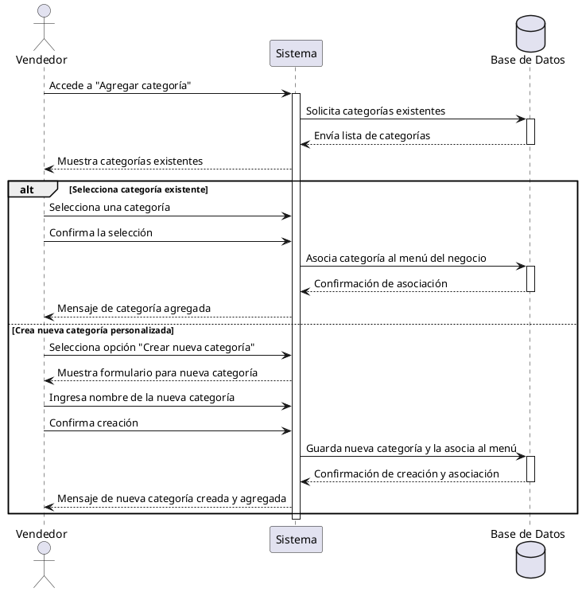

**Nombre:** Agregar Categoría  
**ID:** CU-015  
**Descripción:** Permite al vendedor agregar o seleccionar categorías para su menú.  
**Actor:** Vendedor  

**Precondiciones:**

- El vendedor tiene un negocio.

**Flujo principal:**

1. El vendedor accede a “Agregar categoría”.
2. El sistema muestra categorías existentes.
3. El vendedor selecciona una categoría.
4. Confirma la selección.
5. El sistema agrega las categorías al menú.

**Postcondiciones:**

- Categorías asociadas al negocio.

**Excepciones:**

- Opcionalmente crea una nueva categoría personalizada.

