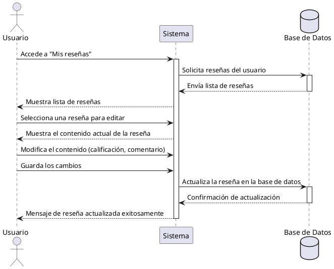

**Nombre:** Editar Reseña  
**ID:** CU-016  
**Descripción:** Permite al usuario modificar una reseña propia.  
**Actor:** Usuario  

**Precondiciones:**

- El usuario ha creado una reseña.

**Flujo principal:**

1. El usuario accede a “Mis reseñas”.
2. Selecciona una reseña.
3. Modifica el contenido.
4. Guarda los cambios.
5. El sistema actualiza la reseña.

**Postcondiciones:**

- Reseña actualizada.

**Excepciones:**

- N/A.
