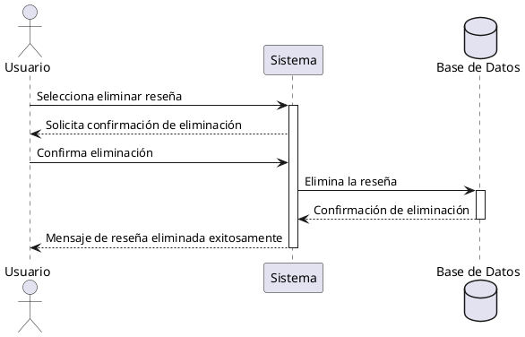

**Nombre:** Eliminar Reseña  
**ID:** CU-017  
**Descripción:** Permite al usuario eliminar una reseña propia.  
**Actor:** Usuario  

**Precondiciones:**

- El usuario tiene reseñas.

**Flujo principal:**

1. El usuario selecciona eliminar reseña.
2. El sistema solicita confirmación.
3. El usuario confirma.
4. El sistema elimina la reseña.

**Postcondiciones:**

- Reseña eliminada.

**Excepciones:**

- N/A.

