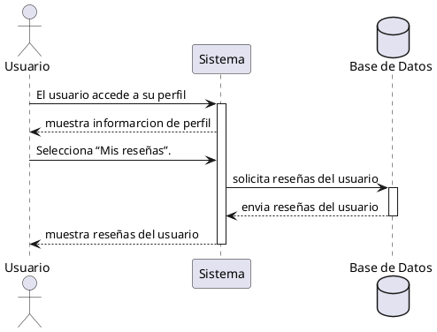

**Nombre:** Ver Mis Reseñas  
**ID:** CU-018  
**Descripción:** Permite al usuario visualizar sus reseñas.  
**Actor:** Usuario  

**Precondiciones:**

- Usuario autenticado.

**Flujo principal:**

1. El usuario accede a su perfil.
2. Selecciona “Mis reseñas”.
3. El sistema muestra la lista.

**Postcondiciones:**

- Reseñas visibles.

**Excepciones:**

- No hay reseñas.

