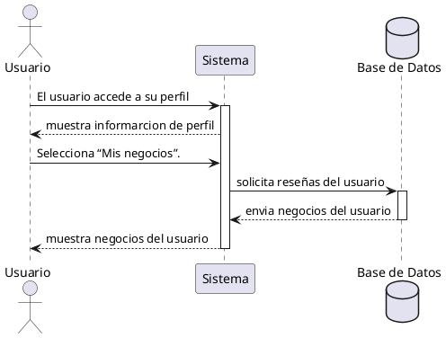

**Nombre:** Ver Mis Negocios  
**ID:** CU-019  
**Descripción:** Permite al vendedor visualizar sus negocios registrados.  
**Actor:** Vendedor  

**Precondiciones:**

- El vendedor tiene negocios registrados.

**Flujo principal:**

1. El vendedor accede a su perfil.
2. Selecciona “Mis negocios”.
3. El sistema muestra la lista.

**Postcondiciones:**

- Negocios visibles.

**Excepciones:**

- No hay negocios.

