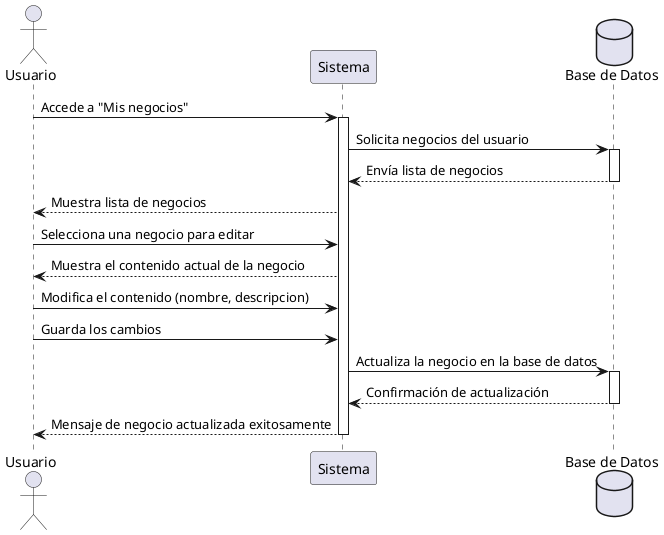

**Nombre:** Editar Negocio  
**ID:** CU-020  
**Descripción:** Permite al vendedor modificar la información de su negocio.  
**Actor:** Vendedor  
**Relación:** Incluye: Ver Mis Negocios

**Precondiciones:**

- El negocio pertenece al vendedor.

**Flujo principal:**

1. El vendedor selecciona un negocio.
2. Modifica los datos.
3. Guarda cambios.
4. El sistema actualiza el negocio.

**Postcondiciones:**

- Negocio actualizado.

**Excepciones:**

-  N/A

