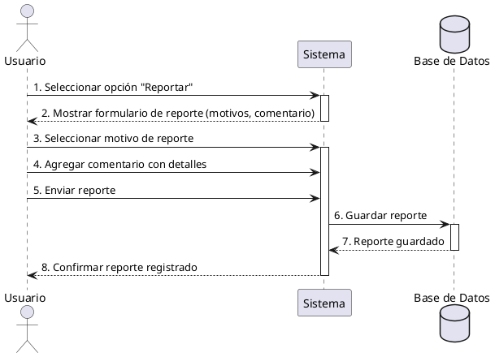

**Nombre:** Reportar Usuario o Reseña  
**ID:** CU-021  
**Descripción:** Permite al usuario reportar contenido inapropiado.  
**Actor:** Usuario  

**Precondiciones:**

- Usuario autenticado.

**Flujo principal:**

1. El usuario selecciona reportar.
2. El sistema muestra formulario.
3. El usuario selecciona motivo.
4. El usuario agrega un comentario con detalles del reporte.
5. Envía reporte.
6. El sistema guarda el reporte.

**Postcondiciones:**

- Reporte registrado.

**Excepciones:**

- Cancelación.

