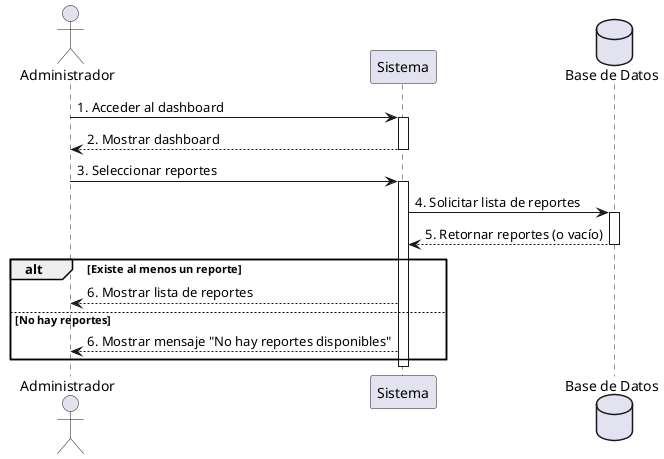

**Nombre:** Ver Reportes  
**ID:** CU-022  
**Descripción:** Permite al administrador visualizar reportes.  
**Actor:** Administrador  

**Precondiciones:**

- Usuario administrador.

**Flujo principal:**

1. Accede al dashboard.
2. Selecciona reportes.
3. El sistema muestra la lista.

**Postcondiciones:**

- Reportes visibles.

**Excepciones:**

- No hay reportes.

