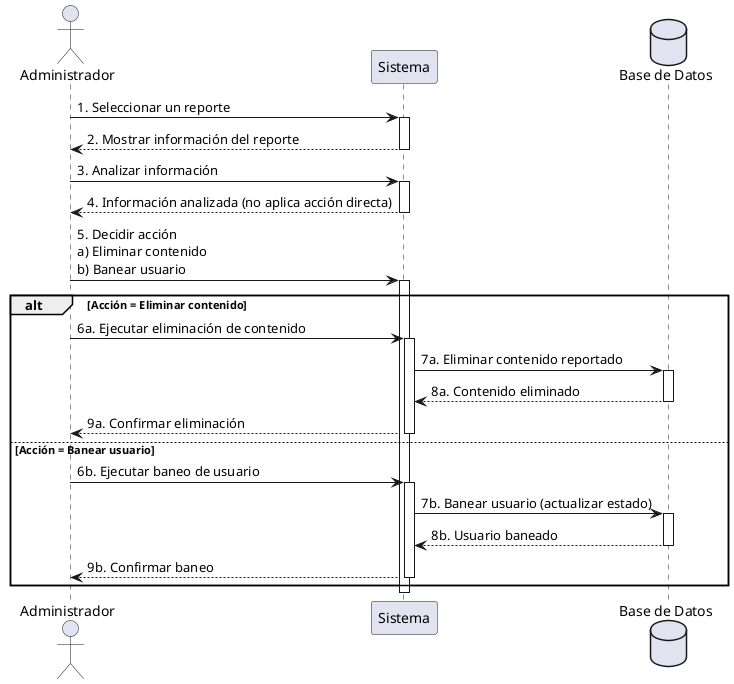

**Nombre:** Administrar Reportes  
**ID:** CU-023  
**Descripción:** Permite al administrador gestionar reportes.  
**Actor:** Administrador  

**Precondiciones:**

- Usuario administrador.

**Flujo principal:**

1. Selecciona un reporte.
2. Analiza información.
3. Decide acción:
    - Eliminar contenido
    - Banear usuario
4. Ejecuta acción.

**Postcondiciones:**

- Acción aplicada.

**Excepciones:**

- N/A.

