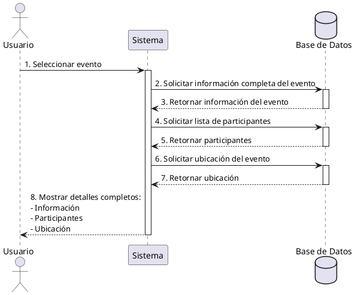

**Nombre:** Ver Detalles de Evento  
**ID:** CU-024  
**Descripción:** Permite visualizar información completa de un evento.  
**Actor:** Usuario  

**Precondiciones:**

- Evento existe.

**Flujo principal:**

1. Usuario selecciona evento.
2. Sistema muestra:
    - Información
    - Participantes
    - Ubicación

**Postcondiciones:**

- Evento visualizado.

**Excepciones:**

- N/A.

