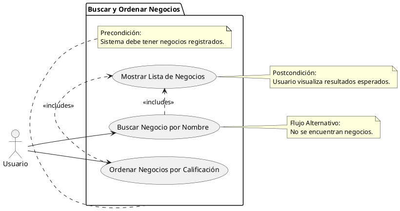

# Buscar y Ordenar Negocios

## Descripción
Permite al usuario buscar un negocio por nombre u ordenarlos por calificación (RF-004, RF-005).

## Condiciones
**Precondiciones:**
El sistema debe tener negocios registrados.

**Postcondiciones:**
El usuario visualiza los resultados esperados.

## Flujo Principal
1.- El usuario navega a la sección de exploración.
2.- El usuario ingresa un nombre en el buscador o selecciona el filtro de orden por calificación.
3.- El sistema procesa la solicitud.
4.- El sistema muestra la lista de negocios que coinciden con los criterios.

## Flujos Alternativos
No se encuentran negocios con el nombre especificado.

# UML

