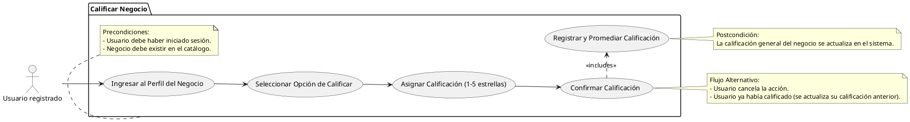

# Calificar Negocio

## Descripción
Permite al usuario calificar negocios en una escala de 1 a 5 estrellas (RF-003).

## Condiciones
**Precondiciones:**
El usuario debe haber iniciado sesión.
El negocio debe existir en el catálogo.

**Postcondiciones:**
La calificación general del negocio se actualiza en el sistema.

## Flujo Principal
1.- El usuario ingresa al perfil del negocio.
2.- El usuario selecciona la opción de calificar.
3.- El usuario asigna una calificación de 1 a 5 estrellas.
4.- El usuario confirma la calificación.
5.- El sistema registra y promedia la calificación del negocio.

## Flujos Alternativos
El usuario cancela la acción.
El usuario ya había calificado (se actualiza su calificación anterior).

# UML

