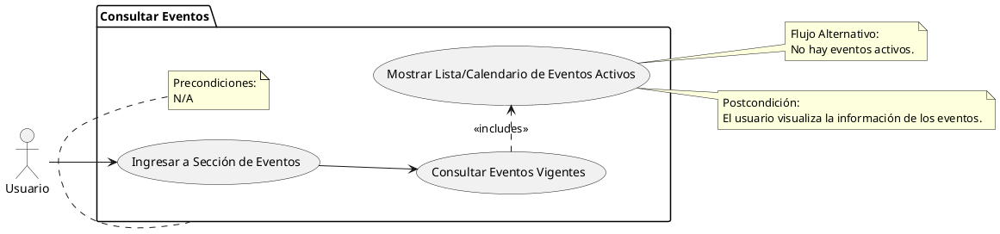

# Consultar Eventos

## Descripción
Permite a los usuarios ver los eventos activos dentro de la universidad (RF-040).

## Condiciones
**Precondiciones:**
N/A

**Postcondiciones:**
El usuario visualiza la información de los eventos.

## Flujo Principal
1.- El usuario ingresa a la sección de eventos.
2.- El sistema consulta la base de datos por eventos vigentes.
3.- El sistema muestra la lista o calendario de eventos activos.

## Flujos Alternativos
No hay eventos activos en ese momento.

# UML
