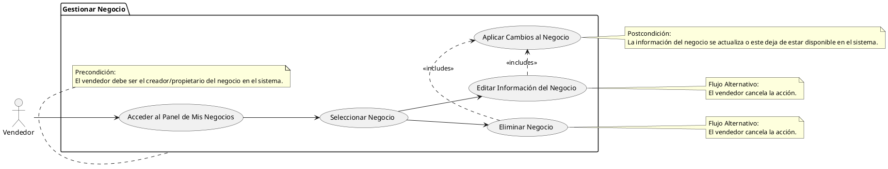

# Gestionar Negocio

## Descripción
Permite a los vendedores editar o eliminar la información de sus propios negocios (RF-015, RF-016).

## Condiciones
**Precondiciones:**
El vendedor debe ser el creador/propietario del negocio en el sistema.

**Postcondiciones:**
La información del negocio se actualiza o este deja de estar disponible en el sistema.

## Flujo Principal
1.- El vendedor accede al panel de mis negocios.
2.- Selecciona un negocio para editar o eliminar.
3.- Si edita, actualiza la información y guarda.
4.- Si elimina, el sistema solicita confirmación y desactiva el negocio.
5.- El sistema aplica los cambios.

## Flujos Alternativos
El vendedor cancela la acción.

# UML
