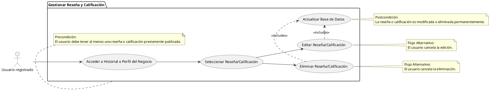

# Gestionar Reseña y Calificación

## Descripción
Permite al usuario editar o eliminar sus propias reseñas y calificaciones (RF-009, RF-010, RF-013).

## Condiciones
**Precondiciones:**
El usuario debe tener al menos una reseña o calificación previamente publicada.

**Postcondiciones:**
La reseña o calificación es modificada o eliminada permanentemente.

## Flujo Principal
1.- El usuario accede a su historial o al perfil del negocio.
2.- Selecciona la opción de editar o eliminar sobre su reseña/calificación.
3.- Si edita, modifica los datos y confirma.
4.- Si elimina, el sistema pide confirmación y procesa el borrado.
5.- El sistema actualiza la base de datos.

## Flujos Alternativos
El usuario cancela la edición o eliminación.

# UML 
