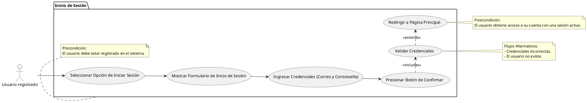

# Inicio de Sesion

## Descripción
Permite al usuario iniciar sesion en el sistema.

## Condiciones
**Precondiciones:**
El usuario debe estar registrado en el sistema.

**Postcondiciones:**
El usuario obtiene acceso a su cuenta con una sesión activa.

## Flujo Principal
1.- El usuario selecciona la opcion de iniciar sesion.
2.- El sistema muestra el formulario de inicio de sesion.
3.- El usuario ingresa:
                   - Correo electronico
                   - Contraseña
4.- El usuario presiona el boton de confirmar.
5.- El sistema valida las credenciales del usuario.
6.- El sistema redirige al usuario a la pagina principal.

## Flujos Alternativos
Credenciales incorrectas.
El usuario no existe.

# UML

