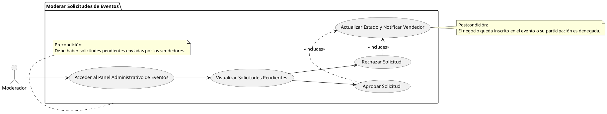

# Moderar Solicitudes de Eventos

## Descripción
Permite a los moderadores aprobar o rechazar solicitudes de negocios para eventos (RF-039).

## Condiciones
**Precondiciones:**
Debe haber solicitudes pendientes enviadas por los vendedores.

**Postcondiciones:**
El negocio queda inscrito en el evento o su participación es denegada.

## Flujo Principal
1.- El moderador accede al panel administrativo de eventos.
2.- Visualiza la lista de solicitudes pendientes.
3.- El moderador selecciona aprobar o rechazar para cada solicitud.
4.- El sistema actualiza el estado y notifica al vendedor.

# UML

