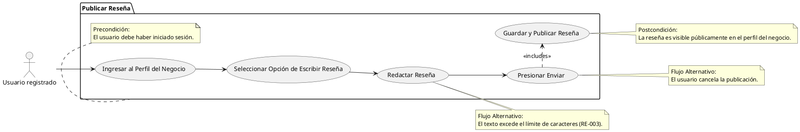

# Publicar Reseña

## Descripción
Permite al usuario publicar reseñas textuales en el perfil de un negocio (RF-006).

## Condiciones
**Precondiciones:**
El usuario debe haber iniciado sesión.

**Postcondiciones:**
La reseña es visible públicamente en el perfil del negocio.

## Flujo Principal
1.- El usuario ingresa al perfil del negocio.
2.- El usuario selecciona la opción de escribir reseña.
3.- El usuario redacta su reseña.
4.- El usuario presiona enviar.
5.- El sistema guarda y publica la reseña en el perfil.

## Flujos Alternativos
El texto excede el límite de caracteres (RE-003).
El usuario cancela la publicación.

# UML

