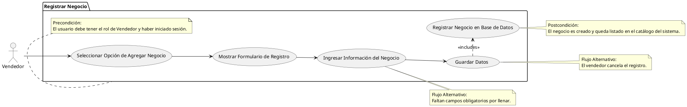

# Registrar Negocio

## Descripción
Permite a los vendedores agregar la información de sus negocios al sistema (RF-014).

## Condiciones
**Precondiciones:**
El usuario debe tener el rol de Vendedor y haber iniciado sesión.

**Postcondiciones:**
El negocio es creado y queda listado en el catálogo del sistema.

## Flujo Principal
1.- El vendedor selecciona la opción de agregar negocio.
2.- El sistema muestra el formulario de registro.
3.- El vendedor ingresa la información solicitada (nombre, descripción, etc.).
4.- El vendedor guarda los datos.
5.- El sistema registra el negocio en la base de datos.

## Flujos Alternativos
Faltan campos obligatorios por llenar.
El vendedor cancela el registro.

# UML

