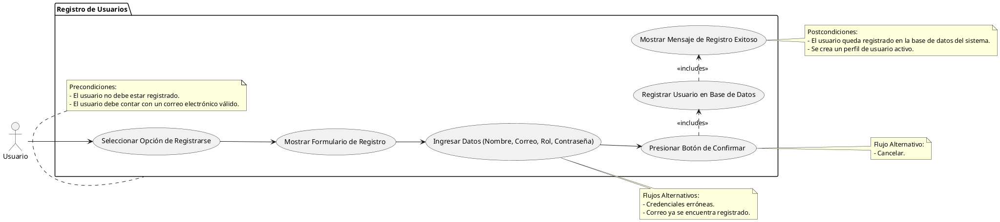

# Registro de Usuarios

## Descripción
Permite al usuario crear una cuenta en el sistema utilizando su correo electronico.

## Condiciones
**Precondiciones:**
El usuario no debe estar registrado en el sistema.
El usuario debe contar con un correo electronico valido.

**Postcondiciones:**
El usuario queda registrado en la base de datos del sistema.
Se crea un perfil de usuario activo.

## Flujo Principal
1.- El usuario selecciona la opcion de registrarse.
2.- El sistema muestra el formulario de registro.
3.- El usuario ingresa:
                  - Nombre
                  - Correo electronico
                  - Rol (Cliente/Vendedor)
                  - Contraseña
                  - Confirmacion de contraseña
4.- El usuario presiona el boton de confirmar.
5.- El sistema registra al usuario en la base de datos.
6.- El sistema muestra un mensaje de registro exitoso.

## Flujos Alternativos
Credenciales erroneas.
Cancelar.
Correo ya se encuentra registrado.

# UML

