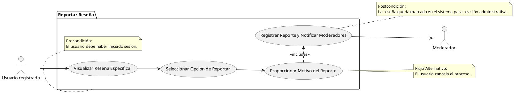

# Reportar Reseña

## Descripción
Permite al usuario reportar una reseña que considere inapropiada (RF-011).

## Condiciones
**Precondiciones:**
El usuario debe haber iniciado sesión.

**Postcondiciones:**
La reseña queda marcada en el sistema para revisión administrativa.

## Flujo Principal
1.- El usuario visualiza una reseña específica.
2.- El usuario selecciona la opción de reportar.
3.- El usuario proporciona el motivo del reporte.
4.- El sistema registra el reporte y notifica a los moderadores.

## Flujos Alternativos
El usuario cancela el proceso.

# UML 

