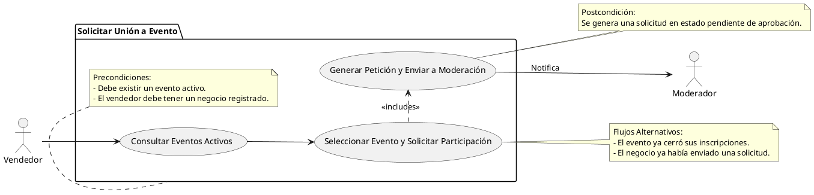

# Solicitar Unión a Evento

## Descripción
Permite a los negocios solicitar unirse a un evento universitario activo (RF-038).

## Condiciones
**Precondiciones:**
Debe existir un evento activo. El vendedor debe tener un negocio registrado.

**Postcondiciones:**
Se genera una solicitud en estado pendiente de aprobación.

## Flujo Principal
1.- El vendedor consulta los eventos activos.
2.- Selecciona un evento y presiona solicitar participación.
3.- El sistema genera la petición y la envía al panel de moderación.

## Flujos Alternativos
El evento ya cerró sus inscripciones.
El negocio ya había enviado una solicitud.

# UML
