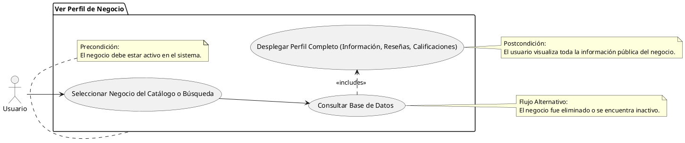

# Ver Perfil de Negocio

## Descripción
Permite al usuario ver la información detallada, reseñas y calificaciones de un negocio (RF-007, RF-008, RF-012).

## Condiciones
**Precondiciones:**
El negocio debe estar activo en el sistema.

**Postcondiciones:**
El usuario visualiza toda la información pública del negocio.

## Flujo Principal
1.- El usuario selecciona un negocio desde el catálogo o búsqueda.
2.- El sistema consulta la base de datos.
3.- El sistema despliega el perfil completo, mostrando calificaciones y lista de reseñas.

## Flujos Alternativos
El negocio fue eliminado o se encuentra inactivo.

# UML
