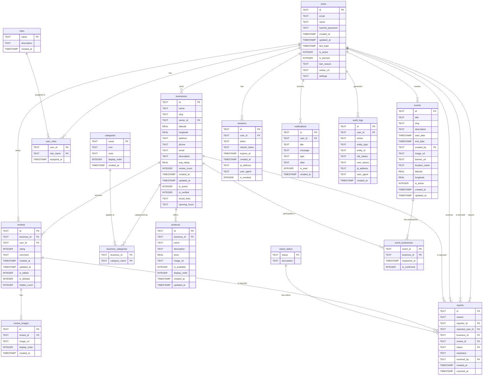

```mermaid
erDiagram
    roles {
        TEXT name PK
        TEXT description
        TIMESTAMP created_at
    }

    categories {
        TEXT name PK
        TEXT icon
        TEXT color
        INTEGER display_order
        TIMESTAMP created_at
    }

    report_status {
        TEXT status PK
        TEXT description
    }

    users {
        TEXT id PK
        TEXT email
        TEXT name
        TEXT hashed_password
        TIMESTAMP created_at
        TIMESTAMP updated_at
        TIMESTAMP last_login
        INTEGER is_active
        INTEGER is_banned
        TEXT ban_reason
        TEXT avatar_url
        TEXT settings
    }

    user_roles {
        TEXT user_id PK
        TEXT role_name PK
        TIMESTAMP assigned_at
    }

    businesses {
        TEXT id PK
        TEXT name
        TEXT slug
        TEXT owner_id FK
        REAL latitude
        REAL longitude
        TEXT address
        TEXT phone
        TEXT email
        TEXT description
        REAL avg_rating
        INTEGER review_count
        TIMESTAMP created_at
        TIMESTAMP updated_at
        INTEGER is_active
        INTEGER is_verified
        TEXT social_links
        TEXT opening_hours
    }

    business_categories {
        TEXT business_id PK
        TEXT category_name PK
    }

    products {
        TEXT id PK
        TEXT business_id FK
        TEXT name
        TEXT description
        REAL price
        TEXT image_url
        INTEGER is_available
        INTEGER display_order
        TIMESTAMP created_at
        TIMESTAMP updated_at
    }

    reviews {
        TEXT id PK
        TEXT business_id FK
        TEXT user_id FK
        INTEGER rating
        TEXT comment
        TIMESTAMP created_at
        TIMESTAMP updated_at
        INTEGER is_edited
        INTEGER is_deleted
        INTEGER helpful_count
    }

    review_images {
        TEXT id PK
        TEXT review_id FK
        TEXT image_url
        INTEGER display_order
        TIMESTAMP created_at
    }

    reports {
        TEXT id PK
        TEXT reason
        TEXT reporter_id FK
        TEXT reported_user_id FK
        TEXT business_id FK
        TEXT review_id FK
        TEXT status FK
        TEXT resolution
        TEXT resolved_by FK
        TIMESTAMP created_at
        TIMESTAMP resolved_at
    }

    events {
        TEXT id PK
        TEXT title
        TEXT slug
        TEXT description
        TIMESTAMP start_date
        TIMESTAMP end_date
        TEXT created_by FK
        TEXT image_url
        TEXT banner_url
        TEXT location_name
        REAL latitude
        REAL longitude
        INTEGER is_active
        TIMESTAMP created_at
        TIMESTAMP updated_at
    }

    event_businesses {
        TEXT event_id PK
        TEXT business_id PK
        TIMESTAMP registered_at
        INTEGER is_confirmed
    }

    sessions {
        TEXT id PK
        TEXT user_id FK
        TEXT token
        TEXT refresh_token
        TIMESTAMP expires_at
        TIMESTAMP created_at
        TEXT ip_address
        TEXT user_agent
        INTEGER is_revoked
    }

    notifications {
        TEXT id PK
        TEXT user_id FK
        TEXT title
        TEXT message
        TEXT type
        TEXT data
        INTEGER is_read
        TIMESTAMP created_at
    }

    audit_logs {
        TEXT id PK
        TEXT user_id FK
        TEXT action
        TEXT entity_type
        TEXT entity_id
        TEXT old_values
        TEXT new_values
        TEXT ip_address
        TEXT user_agent
        TIMESTAMP created_at
    }

    users ||--o{ user_roles : "has"
    roles ||--o{ user_roles : "assigned to"
    users ||--o{ businesses : "owns"
    businesses ||--o{ business_categories : "categorized as"
    categories ||--o{ business_categories : "applies to"
    businesses ||--o{ products : "offers"
    businesses ||--o{ reviews : "receives"
    users ||--o{ reviews : "writes"
    reviews ||--o{ review_images : "has"
    users ||--o{ reports : "reports"
    users ||--o{ reports : "is reported"
    users ||--o{ reports : "resolves"
    businesses ||--o{ reports : "is reported"
    reviews ||--o{ reports : "is reported"
    report_status ||--o{ reports : "has status"
    users ||--o{ events : "creates"
    events ||--o{ event_businesses : "has participants"
    businesses ||--o{ event_businesses : "participates in"
    users ||--o{ sessions : "has"
    users ||--o{ notifications : "receives"
    users ||--o{ audit_logs : "generates"
```

