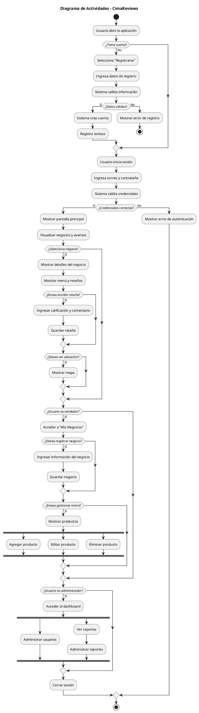

```plantuml
@startuml
title Diagrama de Actividades - CimaReviews

start

:Usuario abre la aplicación;

if (¿Tiene cuenta?) then (No)
  :Selecciona "Registrarse";
  :Ingresa datos de registro;
  :Sistema valida información;

  if (¿Datos válidos?) then (Sí)
    :Sistema crea cuenta;
    :Registro exitoso;
  else (No)
    :Mostrar error de registro;
    stop
  endif
endif

:Usuario inicia sesión;
:Ingresa correo y contraseña;
:Sistema valida credenciales;

if (¿Credenciales correctas?) then (Sí)

  :Mostrar pantalla principal;
  :Visualizar negocios y eventos;

  if (¿Selecciona negocio?) then (Sí)

    :Mostrar detalles del negocio;
    :Mostrar menú y reseñas;

    if (¿Desea escribir reseña?) then (Sí)
      :Ingresar calificación y comentario;
      :Guardar reseña;
    endif

    if (¿Desea ver ubicación?) then (Sí)
      :Mostrar mapa;
    endif

  endif

  if (¿Usuario es vendedor?) then (Sí)

    :Acceder a "Mis Negocios";

    if (¿Desea registrar negocio?) then (Sí)
      :Ingresar información del negocio;
      :Guardar negocio;
    endif

    if (¿Desea gestionar menú?) then (Sí)

      :Mostrar productos;

      fork
        :Agregar producto;
      fork again
        :Editar producto;
      fork again
        :Eliminar producto;
      end fork

    endif

  endif

  if (¿Usuario es administrador?) then (Sí)

    :Acceder al dashboard;

    fork
      :Administrar usuarios;
    fork again
      :Ver reportes;
      :Administrar reportes;
    end fork

  endif

  :Cerrar sesión;

else (No)

  :Mostrar error de autenticación;

endif

stop
@enduml
```
