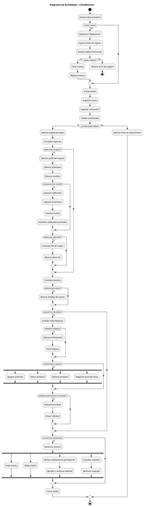

```plantuml
@startuml
title Diagrama de Actividades - CimaReviews

start

:Usuario abre el sistema;

if (¿Tiene cuenta?) then (No)

  :Selecciona "Registrarse";
  :Ingresa datos de registro;
  :Sistema valida información;

  if (¿Datos válidos?) then (Sí)
    :Crear cuenta;
    :Registro exitoso;
  else (No)
    :Mostrar error de registro;
    stop
  endif

endif

:Iniciar sesión;
:Ingresar correo;
:Ingresar contraseña;
:Validar credenciales;

if (¿Credenciales válidas?) then (Sí)

  :Mostrar página principal;

  :Consultar negocios;

  if (¿Selecciona negocio?) then (Sí)

      :Mostrar perfil del negocio;
      :Mostrar productos;
      :Mostrar reseñas;

      if (¿Desea escribir reseña?) then (Sí)
          :Ingresar calificación;
          :Ingresar comentario;
          :Guardar reseña;
          :Actualizar calificación promedio;
      endif

      if (¿Desea ver ubicación?) then (Sí)
          :Consultar API de mapas;
          :Mostrar ubicación;
      endif

  endif

  :Consultar eventos;

  if (¿Selecciona evento?) then (Sí)
      :Mostrar detalles del evento;
  endif

  if (¿Usuario es vendedor?) then (Sí)

      :Acceder a Mis Negocios;

      if (¿Registrar negocio?) then (Sí)
          :Capturar información;
          :Crear negocio;
      endif

      if (¿Administrar negocio?) then (Sí)

          fork

              :Agregar producto;

          fork again

              :Editar producto;

          fork again

              :Eliminar producto;

          fork again

              :Registrar punto de venta;

          end fork

      endif

      if (¿Solicitar participación en evento?) then (Sí)
          :Seleccionar evento;
          :Enviar solicitud;
      endif

  endif

  if (¿Usuario es moderador?) then (Sí)

      :Gestionar eventos;

      fork

          :Crear evento;

      fork again

          :Editar evento;

      fork again

          :Revisar solicitudes de participación;
          :Aprobar o rechazar solicitud;

      fork again

          :Consultar reportes;
          :Gestionar reportes;

      end fork

  endif

  :Cerrar sesión;

else (No)

  :Mostrar error de autenticación;

endif

stop
@enduml
```
