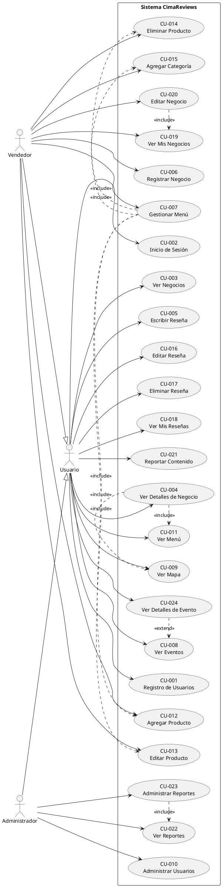

```plantuml
@startuml
left to right direction

actor Usuario
actor Vendedor
actor Administrador

Vendedor --|> Usuario
Administrador --|> Usuario

rectangle "Sistema CimaReviews" {

  usecase "CU-001\nRegistro de Usuarios" as CU001
  usecase "CU-002\nInicio de Sesión" as CU002
  usecase "CU-003\nVer Negocios" as CU003
  usecase "CU-004\nVer Detalles de Negocio" as CU004
  usecase "CU-005\nEscribir Reseña" as CU005
  usecase "CU-006\nRegistrar Negocio" as CU006
  usecase "CU-007\nGestionar Menú" as CU007
  usecase "CU-008\nVer Eventos" as CU008
  usecase "CU-009\nVer Mapa" as CU009
  usecase "CU-010\nAdministrar Usuarios" as CU010
  usecase "CU-011\nVer Menú" as CU011
  usecase "CU-012\nAgregar Producto" as CU012
  usecase "CU-013\nEditar Producto" as CU013
  usecase "CU-014\nEliminar Producto" as CU014
  usecase "CU-015\nAgregar Categoría" as CU015
  usecase "CU-016\nEditar Reseña" as CU016
  usecase "CU-017\nEliminar Reseña" as CU017
  usecase "CU-018\nVer Mis Reseñas" as CU018
  usecase "CU-019\nVer Mis Negocios" as CU019
  usecase "CU-020\nEditar Negocio" as CU020
  usecase "CU-021\nReportar Contenido" as CU021
  usecase "CU-022\nVer Reportes" as CU022
  usecase "CU-023\nAdministrar Reportes" as CU023
  usecase "CU-024\nVer Detalles de Evento" as CU024
}

Usuario --> CU001
Usuario --> CU002
Usuario --> CU003
Usuario --> CU004
Usuario --> CU005
Usuario --> CU008
Usuario --> CU009
Usuario --> CU011
Usuario --> CU016
Usuario --> CU017
Usuario --> CU018
Usuario --> CU021
Usuario --> CU024

Vendedor --> CU006
Vendedor --> CU007
Vendedor --> CU012
Vendedor --> CU013
Vendedor --> CU014
Vendedor --> CU015
Vendedor --> CU019
Vendedor --> CU020

Administrador --> CU010
Administrador --> CU022
Administrador --> CU023

CU007 .> CU012 : <<include>>
CU007 .> CU013 : <<include>>
CU007 .> CU014 : <<include>>
CU007 .> CU015 : <<include>>

CU020 .> CU019 : <<include>>

CU004 .> CU011 : <<include>>
CU004 .> CU009 : <<include>>

CU024 .> CU008 : <<extend>>

CU023 .> CU022 : <<include>>

@enduml
```

