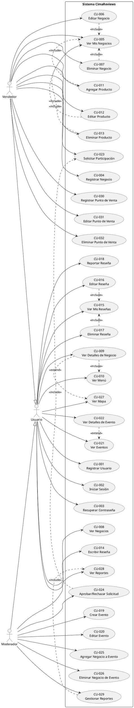

```plantuml
@startuml
left to right direction

actor Usuario
actor Vendedor
actor Moderador

Vendedor --|> Usuario
Moderador --|> Usuario

rectangle "Sistema CimaReviews" {

  usecase "CU-001\nRegistrar Usuario" as CU001
  usecase "CU-002\nIniciar Sesión" as CU002
  usecase "CU-003\nRecuperar Contraseña" as CU003

  usecase "CU-004\nRegistrar Negocio" as CU004
  usecase "CU-005\nVer Mis Negocios" as CU005
  usecase "CU-006\nEditar Negocio" as CU006
  usecase "CU-007\nEliminar Negocio" as CU007

  usecase "CU-008\nVer Negocios" as CU008
  usecase "CU-009\nVer Detalles de Negocio" as CU009
  usecase "CU-010\nVer Menú" as CU010

  usecase "CU-011\nAgregar Producto" as CU011
  usecase "CU-012\nEditar Producto" as CU012
  usecase "CU-013\nEliminar Producto" as CU013

  usecase "CU-014\nEscribir Reseña" as CU014
  usecase "CU-015\nVer Mis Reseñas" as CU015
  usecase "CU-016\nEditar Reseña" as CU016
  usecase "CU-017\nEliminar Reseña" as CU017
  usecase "CU-018\nReportar Reseña" as CU018

  usecase "CU-019\nCrear Evento" as CU019
  usecase "CU-020\nEditar Evento" as CU020
  usecase "CU-021\nVer Eventos" as CU021
  usecase "CU-022\nVer Detalles de Evento" as CU022
  usecase "CU-023\nSolicitar Participación" as CU023
  usecase "CU-024\nAprobar/Rechazar Solicitud" as CU024

  usecase "CU-025\nAgregar Negocio a Evento" as CU025
  usecase "CU-026\nEliminar Negocio de Evento" as CU026

  usecase "CU-027\nVer Mapa" as CU027

  usecase "CU-028\nVer Reportes" as CU028
  usecase "CU-029\nGestionar Reportes" as CU029

  usecase "CU-030\nRegistrar Punto de Venta" as CU030
  usecase "CU-031\nEditar Punto de Venta" as CU031
  usecase "CU-032\nEliminar Punto de Venta" as CU032
}

Usuario --> CU001
Usuario --> CU002
Usuario --> CU003

Usuario --> CU008
Usuario --> CU009
Usuario --> CU010

Usuario --> CU014
Usuario --> CU015
Usuario --> CU016
Usuario --> CU017
Usuario --> CU018

Usuario --> CU021
Usuario --> CU022

Usuario --> CU027

Vendedor --> CU004
Vendedor --> CU005
Vendedor --> CU006
Vendedor --> CU007

Vendedor --> CU011
Vendedor --> CU012
Vendedor --> CU013

Vendedor --> CU023

Vendedor --> CU030
Vendedor --> CU031
Vendedor --> CU032

Moderador --> CU019
Moderador --> CU020
Moderador --> CU024
Moderador --> CU025
Moderador --> CU026
Moderador --> CU028
Moderador --> CU029

CU006 .> CU005 : <<include>>
CU007 .> CU005 : <<include>>

CU011 .> CU005 : <<include>>
CU012 .> CU005 : <<include>>
CU013 .> CU005 : <<include>>

CU016 .> CU015 : <<include>>
CU017 .> CU015 : <<include>>

CU009 .> CU010 : <<include>>
CU009 .> CU027 : <<extend>>

CU022 .> CU021 : <<extend>>

CU029 .> CU028 : <<include>>

CU024 .> CU023 : <<include>>

@enduml
@enduml
```

