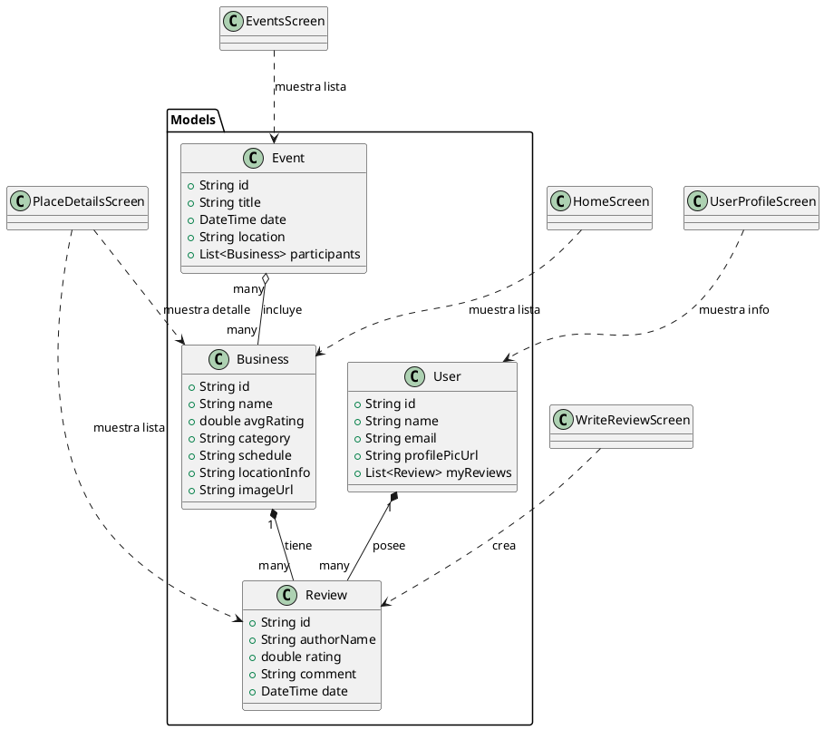

```plantuml
package "Screens (Widgets)" {
    class WelcomeScreen <<Stateless>>
    class LoginScreen <<Stateful>>
    class HomeScreen <<Stateless>>
    class PlaceDetailsScreen <<Stateless>>
    class CampusMapScreen <<Stateless>>
    class ReviewsListScreen <<Stateless>>
    class WriteReviewScreen <<Stateful>>
    class UserProfileScreen <<Stateless>>
    class EventsScreen <<Stateless>>
    class EventDetailsScreen <<Stateless>>
}

' Relaciones de las pantallas con los modelos
HomeScreen ..> Business : muestra lista
PlaceDetailsScreen ..> Business : muestra detalle
PlaceDetailsScreen ..> Review : muestra lista
EventsScreen ..> Event : muestra lista
UserProfileScreen ..> User : muestra info
WriteReviewScreen ..> Review : crea

```
