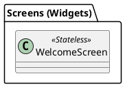
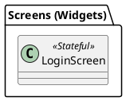
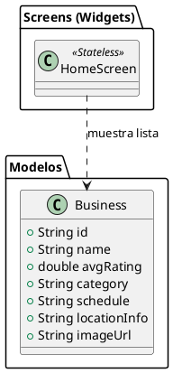
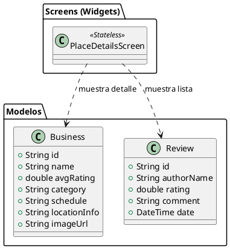
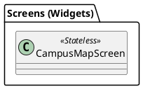
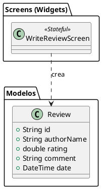
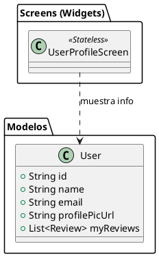
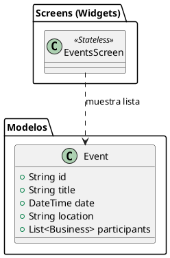

### 1. WelcomeScreen

### 2. LoginScreen

### 3. HomeScreen

### 4. PlaceDetailsScreen

### 5. CampusMapScreen

### 6. ReviewsListScreen

```plantuml
@startuml
package "Screens (Widgets)" {
    class ReviewsListScreen <<Stateless>>
}
' Aunque PlaceDetailsScreen muestra una lista de Reviews, ReviewsListScreen no tiene una relación directa con el modelo Review en el contexto proporcionado.
@enduml
```

### 7. WriteReviewScreen

### 8. UserProfileScreen

### 9. EventsScreen

### 10. EventDetailsScreen

```plantuml
@startuml
package "Screens (Widgets)" {
    class EventDetailsScreen <<Stateless>>
}
' Aunque EventsScreen muestra una lista de Eventos, EventDetailsScreen no tiene una relación directa con el modelo Event en el contexto proporcionado.
@enduml
```

