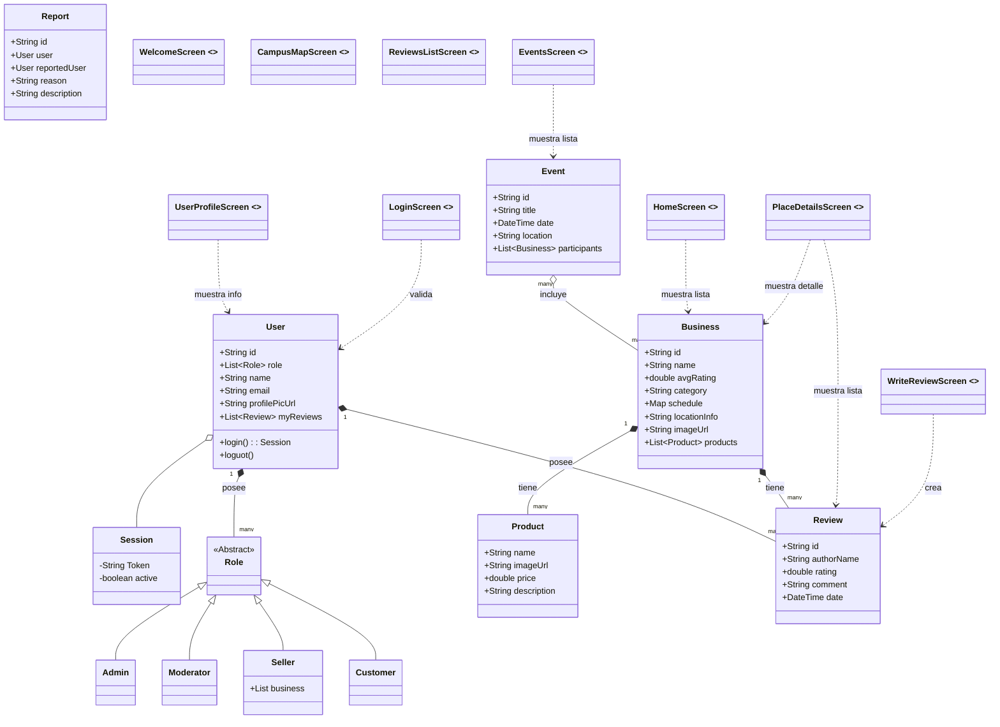

```mermaid
classDiagram
    direction TB

    subgraph Models    
        class User {
            +String id
            +List~Role~ role
            +String name
            +String email
            +String profilePicUrl
            +List~Review~ myReviews
            
            +login(): Session
            +loguot()
        }
        
        class Session{
	        -String Token
	        -boolean active
        }
        
        class Role {
	        <<Abstract>>
        }
        
        class Admin{
        }
        
        class Customer{
        }
        
        class Moderator{
        }
        
        class Seller{
	        +List<Business> business
        }

		class Report{
            +String id
            +User user
            +User reportedUser
            +String reason
            +String description
        }
        
        class Business {
            +String id
            +String name
            +double avgRating
            +String category
            +Map schedule
            +String locationInfo
            +String imageUrl
            +List~Product~ products
        }

		class Product{
			+String name
            +String imageUrl
            +double price
            +String description
		}
        
        class Review {
            +String id
            +String authorName
            +double rating
            +String comment
            +DateTime date
        }

        class Event {
            +String id
            +String title
            +DateTime date
            +String location
            +List~Business~ participants
        }
    end

    subgraph Screens_Widgets
        class WelcomeScreen["WelcomeScreen <<Stateless>>"]
        class LoginScreen["LoginScreen <<Stateful>>"]
        class HomeScreen["HomeScreen <<Stateless>>"]
        class PlaceDetailsScreen["PlaceDetailsScreen <<Stateless>>"]
        class CampusMapScreen["CampusMapScreen <<Stateless>>"]
        class ReviewsListScreen["ReviewsListScreen <<Stateless>>"]
        class WriteReviewScreen["WriteReviewScreen <<Stateful>>"]
        class UserProfileScreen["UserProfileScreen <<Stateless>>"]
        class EventsScreen["EventsScreen <<Stateless>>"]
    end

    %% Relaciones de datos
    User "1" *-- "many" Review : posee
    User "1" *-- "many" Role: posee
    User o-- Session
    Business "1" *-- "many" Review : tiene
    Business "1" *-- "many" Product : tiene
    Event "many" o-- "many" Business : incluye
    Role <|-- Admin
    Role <|-- Moderator
    Role <|-- Seller
    Role <|-- Customer

    %% Relaciones de las pantallas con los modelos
    HomeScreen ..> Business : muestra lista
    PlaceDetailsScreen ..> Business : muestra detalle
    PlaceDetailsScreen ..> Review : muestra lista
    EventsScreen ..> Event : muestra lista
    UserProfileScreen ..> User : muestra info
    LoginScreen ..> User: valida
    WriteReviewScreen ..> Review : crea
```

