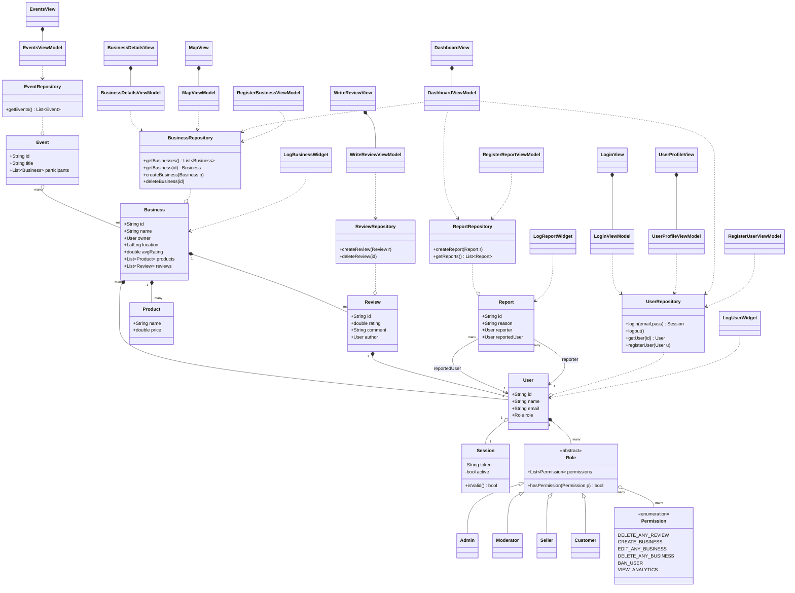

```mermaid
classDiagram
    direction TB

    %% ============================
    %% MODELS (Dominio)
    %% ============================
    subgraph Models
        class User {
            +String id
            +String name
            +String email
            +Role role
        }

        class Session {
            -String token
            -bool active
            +isValid() bool
        }

        class Role {
            <<abstract>>
            +List~Permission~ permissions
            +hasPermission(Permission p) bool
        }

        class Permission {
            <<enumeration>>
            DELETE_ANY_REVIEW
            CREATE_BUSINESS
            EDIT_ANY_BUSINESS
            DELETE_ANY_BUSINESS
            BAN_USER
            VIEW_ANALYTICS
        }

        class Report {
            +String id
            +String reason
            +User reporter
            +User reportedUser
        }

        class Business {
            +String id
            +String name
            +User owner
            +LatLng location
            +double avgRating
            +List~Product~ products
            +List~Review~ reviews
        }

        class Product {
            +String name
            +double price
        }

        class Review {
            +String id
            +double rating
            +String comment
            +User author
        }

        class Event {
            +String id
            +String title
            +List~Business~ participants
        }
    end

    %% ============================
    %% REPOSITORIES (Data Layer)
    %% ============================
    subgraph Repositories
        class UserRepository {
            +login(email,pass) Session
            +logout()
            +getUser(id) User
            +registerUser(User u)
        }

        class BusinessRepository {
            +getBusinesses() List~Business~
            +getBusiness(id) Business
            +createBusiness(Business b)
            +deleteBusiness(id)
        }

        class ReviewRepository {
            +createReview(Review r)
            +deleteReview(id)
        }

        class ReportRepository {
            +createReport(Report r)
            +getReports() List~Report~
        }

        class EventRepository {
            +getEvents() List~Event~
        }
    end

    %% ============================
    %% VIEWMODELS (Lógica de presentación)
    %% ============================
    subgraph ViewModels
        LoginViewModel
        UserProfileViewModel
        WriteReviewViewModel
        BusinessDetailsViewModel
        EventsViewModel
        MapViewModel
        DashboardViewModel
        RegisterUserViewModel
        RegisterBusinessViewModel
        RegisterReportViewModel
    end

    %% ============================
    %% VIEWS (UI)
    %% ============================
    subgraph Views
        LoginView
        UserProfileView
        WriteReviewView
        BusinessDetailsView
        EventsView
        MapView
        DashboardView
        LogUserWidget
        LogBusinessWidget
        LogReportWidget
    end

    %% ============================
    %% RELACIONES MODELS
    %% ============================
    Role <|-- Admin
    Role <|-- Moderator
    Role <|-- Seller
    Role <|-- Customer

    Role "many" o-- "many" Permission
    User "1" *-- "many" Role
    User "1" o-- "1" Session

    Business "1" *-- "many" Product
    Business "1" *-- "many" Review
    Business "many" *-- "1" User

    Review "1" *-- "1" User

    Report "many" --> "1" User : reportedUser
    Report "many" --> "1" User : reporter

    Event "many" o-- "many" Business

    %% ============================
    %% RELACIONES MVVM
    %% ============================

    %% VIEWS -> VIEWMODELS
    LoginView *-- LoginViewModel
    UserProfileView *-- UserProfileViewModel
    WriteReviewView *-- WriteReviewViewModel
    BusinessDetailsView *-- BusinessDetailsViewModel
    EventsView *-- EventsViewModel
    MapView *-- MapViewModel
    DashboardView *-- DashboardViewModel

    %% VIEWMODELS -> REPOSITORIES
    LoginViewModel ..> UserRepository
    UserProfileViewModel ..> UserRepository
    WriteReviewViewModel ..> ReviewRepository
    BusinessDetailsViewModel ..> BusinessRepository
    EventsViewModel ..> EventRepository
    MapViewModel ..> BusinessRepository
    DashboardViewModel ..> UserRepository
    DashboardViewModel ..> BusinessRepository
    DashboardViewModel ..> ReportRepository
    RegisterUserViewModel ..> UserRepository
    RegisterBusinessViewModel ..> BusinessRepository
    RegisterReportViewModel ..> ReportRepository

	%% REPOSITORIES -> MODELS
	EventRepository ..o Event
	UserRepository ..o User
	BusinessRepository ..o Business
	ReportRepository ..o Report
	ReviewRepository ..o  Review

    %% WIDGETS -> MODELS
    LogUserWidget ..> User
    LogBusinessWidget ..> Business
    LogReportWidget ..> Report

```

