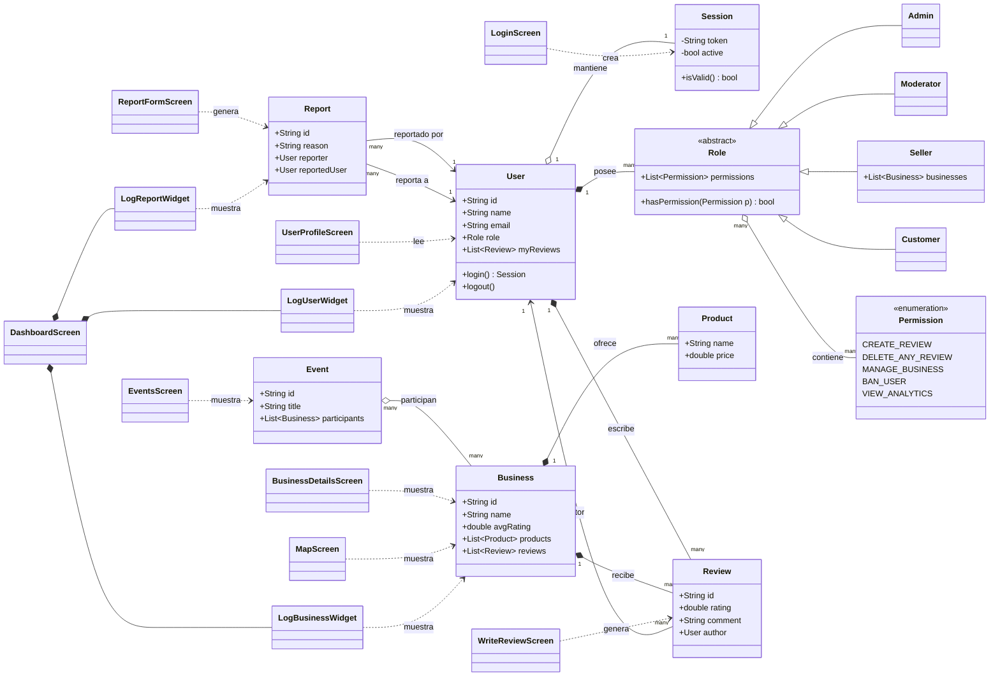

```mermaid
classDiagram
    direction TB

    subgraph Models
        class User {
            +String id
            +String name
            +String email
            +Role role
            +List~Review~ myReviews
            +login() Session
            +logout()
        }
        
        class Session {
            -String token
            -bool active
            +isValid() bool
        }
        
        class Role {
            <<abstract>>
            +List~Permission~ permissions
            +hasPermission(Permission p) bool
        }

        class Permission {
            <<enumeration>>
            CREATE_REVIEW
            DELETE_ANY_REVIEW
            MANAGE_BUSINESS
            BAN_USER
            VIEW_ANALYTICS
        }
        
        class Admin { }
        class Customer { }
        class Moderator { }
        class Seller {
            +List~Business~ businesses
        }

        class Report {
            +String id
            +String reason
            +User reporter
            +User reportedUser
        }
        
        class Business {
            +String id
            +String name
            +double avgRating
            +List~Product~ products
            +List~Review~ reviews
        }

        class Product {
            +String name
            +double price
        }
        
        class Review {
            +String id
            +double rating
            +String comment
            +User author
        }

        class Event {
            +String id
            +String title
            +List~Business~ participants
        }
    end

    %% Relaciones de Herencia y Composición
    Role <|-- Admin
    Role <|-- Moderator
    Role <|-- Seller
    Role <|-- Customer
    Role "many" o-- "many" Permission : contiene

    User "1" *-- "many" Role : posee
    User "1" o-- "1" Session : mantiene
    User "1" *-- "many" Review : escribe
    
    Business "1" *-- "many" Product : ofrece
    Business "1" *-- "many" Review : recibe
    
    Review "many" --> "1" User : autor
    
    Report "many" --> "1" User : reportado por
    Report "many" --> "1" User : reporta a
    
    Event "many" o-- "many" Business : participan

    %% Relaciones Screens
    subgraph Screens_Widgets
        direction LR
        class LoginScreen
        class UserProfileScreen
        class WriteReviewScreen
        class BusinessDetailsScreen
    end

    LoginScreen ..> Session : crea
    UserProfileScreen ..> User : lee
    WriteReviewScreen ..> Review : genera
    BusinessDetailsScreen ..> Business : muestra
    ReportFormScreen ..> Report : genera
    EventsScreen ..> Event : muestra
    MapScreen ..> Business : muestra
    DashboardScreen *-- LogUserWidget
    DashboardScreen *-- LogBusinessWidget
    DashboardScreen *-- LogReportWidget 
    LogUserWidget ..> User : muestra
    LogBusinessWidget ..> Business : muestra
    LogReportWidget ..> Report : muestra
```

